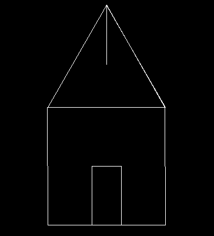

# LOGO-py

A simple pygame implementation of the LOGO programming language.

## Its broken for the most part

 - Pen up/down commands dont work and I'm super confused as to why.
 - For some reason, commands are only valid when they are padded with spaces.
    - i.e. `repeat 2 [fd 10 ] ` is valid but `repeat 2 [fd 10]` is not.
    - probably a noob regex mistake.
 - Nested `repeat` commands are not supported due to regex limitations.
 - `forever` loops lock everything up because it currently tries to finish drawing everything before showing it on-screen.
## Usage

```bash
$ python3 src/logo/logo.py <filepath>
```

For example, passing [`demo.logo`](demo.logo) will open a pygame window and draw a house:
```bash
$ python3 src/logo/logo.py demo.logo
```

... at least it tries the best it can given the current state of the interpreter.

